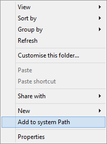

Add To System Path
==================

Simple tool that adds **Add to system Path** item to directory context menu.

Install
-------

[Download](https://github.com/mac2000/add2path/archive/master.zip) and extract files.

Run `Install.cmd` as Administrator.

Relogin or reboot.

Uninstall
---------

Just run `Uninstall.cmd` as Administrator.